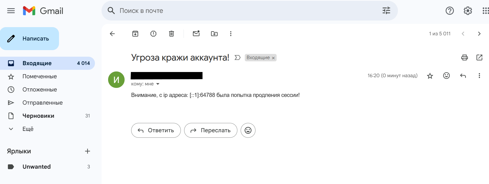

# AccessRefreshToken
Часть сервиса аутентификации для получения access и refresh токенов и обновления access по refresh

## Требования

- Golang 1.23.6
- PostgreSQL 17.4-1

## Настройка

Создайте файл `.env` в корне проекта со следующими параметрами:

```ini
PORT="8080"

# Database configuration
DBHOST="db_host"
DBPORT="port"
DBUSER="user"
DBPASSWORD="password"
DBNAME="db_name"
SSLMODEDB="disable"

# Email settings
EMAIL_SMTP="email"

# Access token settings
TIMEALIVE_ACCESS_TOKEN="number"
TYPE_DURATION_ACCESS="type" # ("minute", "hour", "second")

# Refresh token settings
TIMEALIVE_REFRESH_TOKEN="number"
TYPE_DURATION_REFRESH="type" # ("minute", "hour", "second")
LENGHT_REFRESH_TOKEN="number"
```

## API Endpoints

### Получение токенов

`GET /auth/tokens`

Получение access и refresh токенов для GUID пользователя.

### Обновление токена

`POST /auth/refresh`

Обновление токенов. Проверяет:
- Корректность токена
- Время жизни токена
- Совпадение IP адреса владельца токена и отправителя операции

В случае различия IP адресов, отправляется предупреждение:



## Запуск проекта

1. Установите зависимости:
```bash
go mod download
```

2. Запустите сервер:
```bash
go run main.go
```

Сервер будет доступен на порту, указанном в `.env` файле (по умолчанию 8080).
```